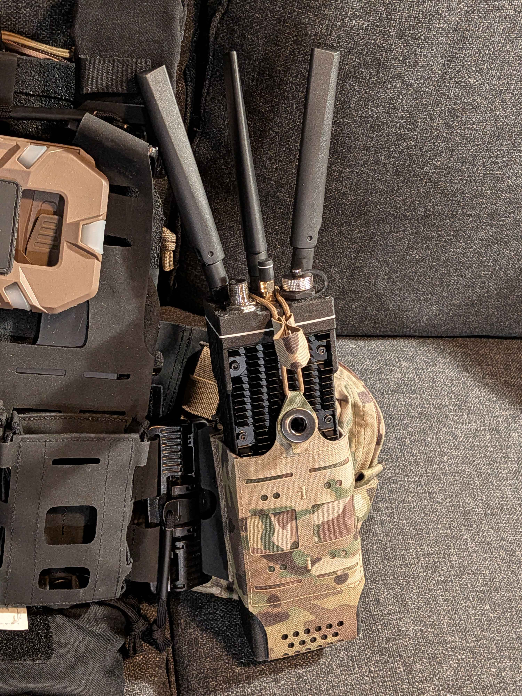

# RDT MANET Radio Enclosure

A 3D-printable, weather-resistant and waterproof enclosure for a portable mesh radio node built around the Raspberry Pi Compute Module 4, Waveshare Mini Base Board (A), MediaTek MT7916 Wi-Fi 6E card and a Morse Micro MM8108 Wi-Fi HaLow board.

The enclosure was designed for the [very-srs/MANET](https://github.com/very-srs/MANET) project, and it also fits hardware deployments of [OpenMANET](https://github.com/openmanet).




---

## Table of Contents

- [Overview](#overview)
- [Features](#features)
- [Compatible Hardware](#compatible-hardware)
- [Bill of Materials](#bill-of-materials)
- [Repository Structure](#repository-structure)
- [Printing](#printing)
- [Assembly](#assembly)
- [Power](#power)
- [Thermal Notes](#thermal-notes)
- [RF Notes](#rf-notes)
- [Software](#software)
- [Contributing](#contributing)
- [License](#license)
- [Disclaimer](#disclaimer)
- [Acknowledgements](#acknowledgements)

---

## Overview

This repository contains the printable parts (STL) for a self-contained MANET radio node. The enclosure houses:

- a **Raspberry Pi CM4** on a **Waveshare Mini Base Board (A)** carrier,
- an **MT7916 Wi-Fi 6E M.2 A/E-key card**, mounted in the carrier's M.2 M-key slot through an **M.2 M-key → A/E-key adapter (Note: Only two of the three antennas send, specifically 1 and 2, the ones on the short end of the MT7916 board. The 3rd is only receiving on 5GHz in 2T3R mode.)**,
- a **Lunpid Morse Micro MM8108 Wi-Fi HaLow** board connected over USB-C,
- a **Pololu D36V28F5** 5 V step-down regulator,

and exposes three SMA antenna ports for the MT7916, one SMA port for the HaLow radio, a waterproof USB-C port, an M12 connector to internal Ethernet port and a magnetic pogo-pin power input.

## Features

- Fully 3D-printable body, no custom PCBs required
- 3× SMA bulkhead mounts for 2.4 / 5 / 6 GHz MIMO antennas (Note: see reference to antenna positioning in #Overview section above, subsection MT7916)
- 1× SMA bulkhead mount for the sub-GHz HaLow antenna
- Waterproof panel-mount USB-C for access to the carrier board
- M12 connector for ruggedized wired Ethernet
- 3-pin magnetic pogo-pin power input, regulated on board to 5 V
- Heat-set-insert design using M2.5 and M3 hardware
- Cables

## Compatible Hardware

| Component | Model | Notes |
|---|---|---|
| Compute | Raspberry Pi Compute Module 4 — CM4004032 | 4 GB RAM, 32 GB eMMC, **no** onboard Wi-Fi/BT requried |
| Carrier | Waveshare Mini Base Board (A) (CM4-IO-BASE-A) | Gigabit Ethernet, 2× USB 2.0, M.2 M-key (PCIe), 5 V USB-C input |
| Wi-Fi 6E | AsiaRF AW7916-AED (MediaTek MT7916AN) | M.2 A/E-key, 2.4 GHz 2T2R + 5/6 GHz, 3× IPEX antenna connectors |
| M.2 adapter | M.2 M-key → M.2 A/E-key adapter | Lets the A/E-key Wi-Fi card sit in the carrier's M-key slot |
| HaLow | Morse Micro MM8108 board | 802.11ah, connected to the carrier via USB-C |
| Regulator | Pololu D36V28F5 | 5 V, 3.2 A step-down; wide input range |
| Heatsink - MT7916 | Wakefield 559-50AB-ND | Heatsink for MT7916 card

Other CM4 variants (different RAM/eMMC sizes) fit the same carrier. Variants **with** onboard wireless also fit, but their onboard antenna will be shielded by the enclosure and are also not used.

## Bill of Materials

The full parts list, with quantities and supplier links, is in **[BOM.md](BOM.md)**.

Summary of what you'll need beyond the printed parts:

- Core electronics: CM4, carrier board, MT7916 card, M.2 adapter, MM8108 HaLow board, Pololu regulator
- Antennas: 3× SMA (2.4/5/6 GHz) + 1× SMA adapter for HaLow board
- Connectors and cables: waterproof USB-C, M12 Ethernet, magnetic pogo-pin power, USB-A to USB-C adapter, internal USB-C cables
- Hardware: Heatsink, M2.5 and M3 screws, M3 nuts

## Repository Structure

```
.
├── stl/              # Printable parts
├── source/           # Editable CAD source files (STEP / native format) #To be potentially added in the future
├── images/           # Photos and renders
├── docs/             # Additional assembly or wiring notes
├── BOM.md            # Bill of materials
├── LICENSE           # GNU GPL v3.0
└── README.md
```

| File | Part | Qty |
|---|---|---|
| `stl/Unibody.stl` | Main body  to be printed in PA6-GF | 1 |
| `stl/TopConnectorPlate.stl` | Top I/O plate - PA6-GF | 1 |
| `stl/BackPanel.stl` | Back panel - PA6-GF | 1 |
| `stl/TPU_gasket_back.stl` | Back gasket to be printed in TPU | 1 |
| `stl/TPU_gasket_top` | Top gasket - TPU | 1 |
| `stl/Connector_MagneticPogoPIN_mount` | Pogo-pin connector mounting bracket - PA6-GF | 1 |
| `stl/Connector_MagneticPogoPIN_TPU_gasket` | Pogo-pin connector gasket - TPU | 1 |

## Printing

Recommended settings (adjust for your printer):

| Setting | Value |
|---|---|
| Material | PA6-GF or PETG-CF for enclosure and TPU for gaskets|
| Layer height | 0.08 mm |
| Walls / perimeters | 2 - 4 |
| Infill | 35 %  to 45 % |
| Supports | Default, tree |
| Nozzle | 0.4 mm |

Notes:
- Avoid PLA for field units: it softens in direct sunlight and in a warm vehicle.
- Print the body with the bottom side up ( battery connector facing upwards ) or front-facing open side up for the cleanest sealing surface.
- Test-fit the SMA bulkheads and M12 connector before final assembly; hole tolerances vary between printers.
- For waterproof-sealing, treat all printed components with a polimer sealant like Diamant's Dichtol AM Hydro (Note: link provided in **[BOM.md](BOM.md)**)

## Assembly

<!-- TODO: expand with photos per step -->

1. **Prepare the compute stack.** Seat the CM4 on the Waveshare carrier. Install the M.2 M→A/E adapter in the carrier's M.2 slot and fit the MT7916 card to the adapter.
2. **Attach antenna pigtails.** Connect the three IPEX leads to the MT7916 card before mounting it; access is limited once installed.
3. **Mount bulkhead connectors.** Install the 3× SMA bulkheads, the HaLow SMA, the waterproof USB-C, the M12 connector and the magnetic pogo-pin connector in the enclosure walls.
4. **Mount the carrier.** Fix the carrier into the body with M2.5 screws.
5. **Mount the Pololu regulator** with M3 hardware and wire it: pogo-pin input → Pololu VIN/GND, Pololu 5 V output → USB-C cable → carrier board power input.
6. **Mount the HaLow board** and connect it to the carrier with the short USB-C to USB-C cable. Connect its antenna lead to the HaLow SMA bulkhead.
7. **Connect Ethernet:** carrier RJ45 → M12 internal cable.
8. **Close the enclosure** with M3 screws and nuts. Check that no cable is pinched at the lid seam.

## Power

```
[External source] ──► 3-pin magnetic pogo connector ──► Pololu D36V28F5 (5 V) ──► USB-C ──► Waveshare carrier
                                                                                              ├── CM4
                                                                                              ├── M.2 → MT7916 (3.3 V rail)
                                                                                              └── USB-C → MM8108 HaLow
```

- The D36V28F5 accepts a wide input range and outputs a regulated 5 V. **Check the input limits on the Pololu product page before connecting any source.**
- Double-check pogo-pin polarity before first power-up. There is no reverse-polarity protection in this design unless you add it. <!-- TODO: confirm -->
- The Waveshare carrier's 5 V input is specified for about 2.5 A. The MT7916 card is the biggest single load; see below.

## Thermal Notes

- The MT7916 card can draw several watts under load and needs its heatsink fitted.
- The CM4 benefits from a heatsink, especially in a sealed enclosure. 
- A sealed printed enclosure has limited heat dissipation. For sustained high-throughput use or hot climates, consider reducing Wi-Fi TX power or adding ventilation.

## RF Notes

- Use antennas rated for the bands you operate on (2.4 / 5 / 6 GHz for the MT7916; your regional sub-GHz band for HaLow).
- Never transmit without antennas connected, can damage components.
- Keep IPEX-to-SMA pigtails short and avoid sharp bends.
- **You are responsible for operating within your local regulatory limits** (channels, transmit power, EIRP, 6 GHz availability).

## Software

This repository contains **hardware only**. For firmware and mesh configuration see:

- [very-srs/MANET](https://github.com/very-srs/MANET). This enclosure is primarily designed for use with the very-srs project but can fit OpenMANET as well.
- [OpenMANET](https://github.com/openmanet)

## Contributing

Issues and pull requests are welcome.

- Describe what you changed and why (fit issue, new variant, print improvement).
- Include the **editable source file** along with any updated STL.
- Note the printer, material and settings you tested with.
- Photos of printed or assembled parts are very helpful.

## License

This project is licensed under the **GNU General Public License v3.0**. See [LICENSE](LICENSE) for the full text.

You may use, modify and redistribute these files, including commercially, provided that any distributed derivative is released under the same license and includes its corresponding source files.

Third-party components listed in the BOM are the property of their respective manufacturers and are not covered by this license.

## Disclaimer

This design is provided **as is, without warranty of any kind**. You assume all risk associated with building, powering and operating this device, including electrical safety, battery handling, weatherproofing and radio-regulatory compliance.

## Acknowledgements

- [very-srs/MANET](https://github.com/very-srs/MANET) and [OpenMANET](https://github.com/openmanet) projects.
- Raspberry Pi, Waveshare, AsiaRF, Morse Micro and Pololu for the hardware.
